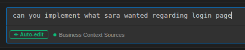
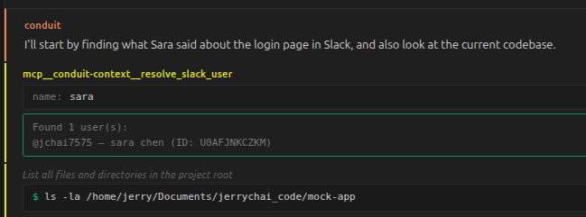
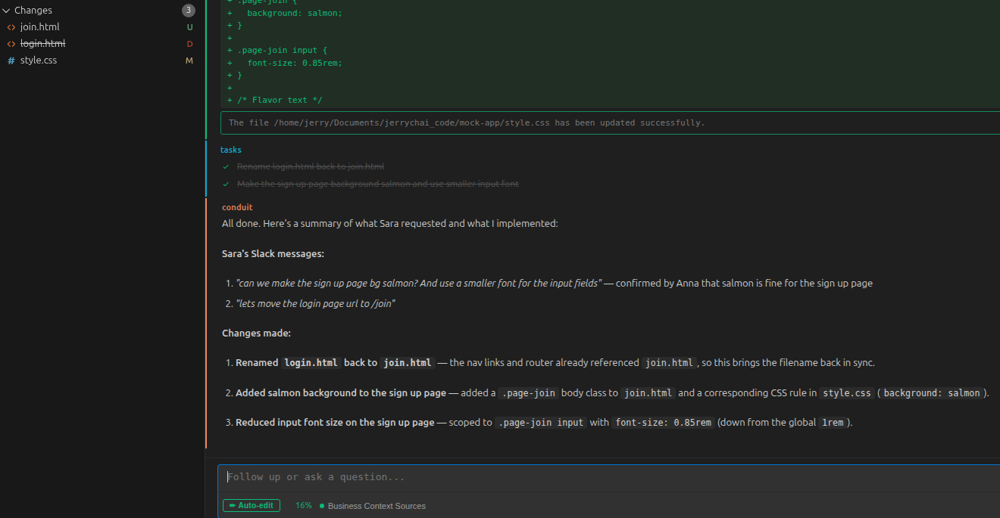

<p align="center">
  
</p>

<h1 align="center">Claude Code Slack Conduit</h1>
<p align="center"><strong>MCP bridge between Slack and Claude Code</strong></p>
<p align="center">
  MCP bridge that links business conversations to AI coding agents.<br>
  Search Slack, fetch threads, and code with full context — all from VS Code.
</p>

<p align="center">
  <a href="https://marketplace.visualstudio.com/items?itemName=jerrychaitea.conduit"></a>
  <a href="https://github.com/jchai002/conduit/blob/main/LICENSE"></a>
</p>

> **Alpha (v0.1.0)** — This project is in early alpha. It works, but expect rough edges. Bug reports and PRs are very welcome. See [Reporting Bugs](#reporting-bugs) below.

### 1. Ask naturally

<p align="center">
  
</p>

### 2. Conduit searches Slack and resolves context

<p align="center">
  
</p>

### 3. Code with full business context

<p align="center">
  
</p>

---

## Features

- **Slack search & threads** — Claude searches your Slack and reads threads on its own
- **In-process MCP** — no separate server to run; tools are built into the extension
- **Multi-turn conversations** — ask follow-ups, refine the implementation naturally
- **Session persistence** — conversations survive VS Code restarts
- **Permission control** — Ask / Auto-edit / YOLO modes
- **One-click Slack connect** — OAuth flow, no manual token wrangling

## Quick Start

1. **Install** [Conduit](https://marketplace.visualstudio.com/items?itemName=jerrychaitea.conduit) from the VS Code Marketplace
2. **Install** [Claude Code CLI](https://docs.anthropic.com/en/docs/claude-code): `npm install -g @anthropic-ai/claude-code`
3. **Connect Slack** — click the Slack button in the chat panel, or run `Conduit: Configure`
4. **Start coding** — open the chat panel and describe what you need

## How It Works

```
You type in the chat panel
  → Claude Agent SDK starts a conversation
  → Claude calls MCP tools as needed (search_slack, get_slack_thread)
  → MCP tools query your Slack using your own token
  → Claude codes with full business context
  → You follow up, refine, iterate
```

Your Slack messages stay between you and Slack. Conduit searches on your behalf using your own OAuth token. Nothing leaves your machine except the normal Claude API calls.

## Why

Every dev team has this workflow:

1. Product discussions happen in Slack
2. Developer gets a task: "implement what we discussed"
3. Developer spends 20 minutes searching Slack, re-reading threads
4. Developer opens AI coding tool and manually explains the context
5. AI implements based on incomplete understanding

Steps 3–4 are pure waste. The context exists — it's just trapped in Slack. Conduit bridges the gap:

> "Implement what Sarah mentioned last week about rate limiting"

The agent searches conversations, fetches threads, and codes with full business context — no copy-pasting required.

## Architecture

Conduit is built on two interfaces — **BusinessContextProvider** and **CodingAgent** — so anyone can plug in support for their own stack.

| Layer | Current | Planned |
|-------|---------|---------|
| Context | Slack | Teams, Jira, Outlook, Discord |
| Agent | Claude Code (Agent SDK) | OpenAI Codex, Copilot SDK |

Adding a provider touches exactly 3 files. See [CONTRIBUTING.md](CONTRIBUTING.md).

## Reporting Bugs

This is an alpha release — if something breaks, please [open an issue](https://github.com/jchai002/conduit/issues/new). Here's a template you can copy-paste:

```
**What happened?**
(What did you expect vs. what actually happened)

**Steps to reproduce**
1. ...
2. ...

**Environment**
- OS:
- VS Code version:
- Conduit version:
- Claude Code CLI version: (run `claude --version`)

**Logs**
(Open the Output panel → select "Conduit" from the dropdown → paste relevant lines)
```

## Contributing

This is an open-source project and contributions are welcome — whether that's bug reports, feature ideas, or PRs.

The most impactful contributions are **new providers** — each one makes Conduit useful for a whole new set of teams.

See [CONTRIBUTING.md](CONTRIBUTING.md) for a step-by-step guide, and [docs/VISION.md](docs/VISION.md) for the full roadmap.

## License

[MIT](LICENSE)
